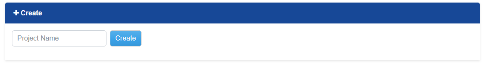
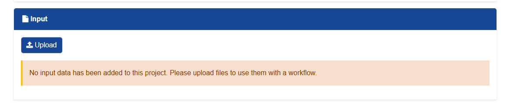

# Creating an Astrocyte Project

Use these steps to create a project in Astrocyte and upload workflow input data.

## Steps

1. Go to the **My Project** page in Astrocyte.

   

2. Scroll to the create project section.

3. Enter a project name, then press **Create**.

   

4. After the project opens, find the **Input** area and click **Upload**.

   

5. Upload the input data through the upload channel you want to use.

After the upload completes, the files should appear in the project input area and
can be selected when launching a workflow.
